<!-- 手作り — every pixel below is hand-drawn SVG, not a widget -->



```console
ansh@tokyo:~$ whoami
──────────────────────────────────────────────────────────────
        ⛩️            ansh aneja — アンシュ
      /    \          ─────────────────────────────
     /______\         Role      AI Engineer @ Rimo (Tokyo, remote)
    |  |  |  |        Uni       DTU New Delhi · B.Tech CSE · 8.59
    |  |  |  |        Uptime    since 2022, zero unplanned downtime
   _|__|__|__|_       Shell     go, typescript, python
                      Packages  llm-agents, rag, e2b, promptfoo
  os: production      Theme     tokyo-night (obviously)
──────────────────────────────────────────────────────────────

ansh@tokyo:~$ cat ./impact.log
[OK] slack translation SaaS ..... 35+ workspaces · 2M+ chars/month
[OK] slack marketplace .......... LIVE — deployed & monetized
[OK] languages supported ........ 26 ──▶ 50
[OK] inference latency .......... cut by 50% · api costs cut ~70%
[OK] mldl.study ................. 23,000 learners · 150+ countries · ⭐370+
[OK] engimatch .................. 500K page views in 72 hours
[OK] support tickets @ bachatt .. reduced 36% with RAG
[OK] llm failures ............... relocated from prod ──▶ CI, permanently

ansh@tokyo:~$ █
```
