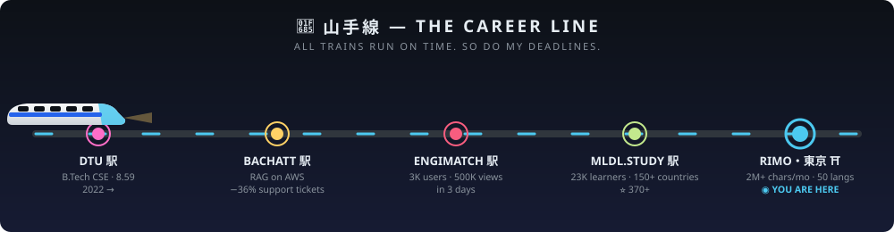

<!-- 手作り — every pixel below is hand-drawn SVG, not a widget -->


```console
ansh@tokyo:~$ whoami
──────────────────────────────────────────────────────────────
        ⛩️            ansh aneja — アンシュ
      /    \          ─────────────────────────────
     /______\         Role      AI Engineer @ Rimo (Tokyo, remote)
    |  |  |  |        Uni       DTU New Delhi · B.Tech CSE · 8.59
    |  |  |  |        Uptime    since 2022, zero unplanned downtime
   _|__|__|__|_       Shell     go, typescript, python
                      Packages  llm-agents, rag, e2b, promptfoo
  os: production      Theme     tokyo-night (obviously)
──────────────────────────────────────────────────────────────

ansh@tokyo:~$ cat ./impact.log
[OK] slack translation SaaS ..... 35+ workspaces · 2M+ chars/month
[OK] slack marketplace .......... LIVE — deployed & monetized
[OK] languages supported ........ 26 ──▶ 50
[OK] inference latency .......... cut by 50% · api costs cut ~70%
[OK] mldl.study ................. 23,000 learners · 150+ countries · ⭐370+
[OK] engimatch .................. 500K page views in 72 hours
[OK] support tickets @ bachatt .. reduced 36% with RAG
[OK] llm failures ............... relocated from prod ──▶ CI, permanently

ansh@tokyo:~$ █
```





<br/>

<div align="center">

## 🏮 自動販売機 — THE VENDING MACHINE

*Tokyo has 4 million vending machines. This profile has one. Insert coin, pick a drink.*

</div>

<details>
<summary>&nbsp;🥤&nbsp;<b>「TRANSLATE-O-CULT」</b> — the bilingual Slack SaaS &nbsp;<code>¥120</code></summary>
<br/>

> **カシャン！** *(the can drops)*
>
> Shipped end-to-end at **Rimo**: a real-time bilingual Slack translation platform, from early prototype to **live, monetized product**.
> - 🌏 35+ active workspaces, **2M+ characters translated per month**
> - ⚡ Latency **−50%** — fused language detection + translation into one structured-output call
> - 🈳 26 → **50 languages**, formatting preserved across code blocks, mentions, emoji, CJK
> - 💴 Built the money layer too: Polar.sh subscriptions, race-safe atomic usage metering, tiered pricing
> - 🛡️ Prompt-injection hardened; recurring LLM failures moved out of prod and into CI

</details>

<details>
<summary>&nbsp;🍵&nbsp;<b>「AGENT GENMAICHA」</b> — the autonomous AI agent &nbsp;<code>¥150</code></summary>
<br/>

> **カシャン！**
>
> An autonomous task agent that operates a real computer:
> - 🖥️ **E2B desktop sandboxes** + headless Chrome + **live VNC streaming**
> - 🔐 Completes workflows behind authenticated logins; sessions persist on Cloud Run
> - 📊 Generates **editable .pptx**; pluggable image gen (Gemini / GPT-Image-2, per-request)
> - 🧪 Wrapped in a full eval + observability stack — Promptfoo suites, Arize AX tracing, automated prompt optimization

</details>

<details>
<summary>&nbsp;🍜&nbsp;<b>「MLDL.STUDY RAMEN」</b> — 23,000 servings &amp; counting &nbsp;<code>¥0 — free forever</code></summary>
<br/>

> **カシャン！**
>
> Open-source ML/DL roadmap platform: [mldl.study](https://mldl.study) · [repo](https://github.com/anshaneja5/mldl.study)
> - 🎓 **23,000+ learners** across **150+ countries**
> - ⭐ **370+ stars** — ML, deep learning, transformers, LLMs, computer vision
> - 🍥 One bowl, every topping: videos, papers, competitions, projects

</details>

<details>
<summary>&nbsp;🧋&nbsp;<b>「ENGIMATCH SODA」</b> — 500K views in 72h &nbsp;<code>¥100</code></summary>
<br/>

> **カシャン！**
>
> Event-based dating platform for college fests — built, monetized, viral:
> - 💘 **3,000 users · 500,000+ page views in 3 days** · 100+ successful matches
> - 💳 Cashfree payments with backend verification · MERN · Vercel

</details>

<details>
<summary>&nbsp;🎰&nbsp;<b>???</b> — the mystery button nobody presses &nbsp;<code>¥500</code></summary>
<br/>

> **ガチャン…コロコロ…** *(a capsule rolls out)*
>
> 🥠 **Fortune inside:** *"Your LLM output is only as deterministic as your eval suite."*
>
> You found the gacha. Since you're here — the RAG assistant I built at **Bachatt** cut human support tickets by **36%**,
> and I once migrated **15+ repos** across GitHub orgs while restoring CI/CD, Workload Identity Federation, and release
> pipelines — with zero downtime. That's the stuff that never fits on the front of the machine. 🎁
>
> <details>
> <summary>&nbsp;&nbsp;🗝️ there is a second capsule…</summary>
> <br/>
>
> > *開発者の俳句 — a developer's haiku:*
> >
> > *prompts fail in prod —* 🍂
> > *I move the failures to CI,*
> > *cherry blossoms bloom* 🌸
>
> </details>

</details>

<br/>

<div align="center">

## 🐍 桜蛇 — THE SAKURA SERPENT

*It feeds nightly on my commit graph.*

<picture>
  <source media="(prefers-color-scheme: dark)" srcset="https://raw.githubusercontent.com/anshaneja5/anshaneja5/output/github-snake-dark.svg" />
  
</picture>

<br/><br/>

## ⛩️ 縁 — EN

*In Japan,* 縁 *(en) is the invisible thread that connects people who were meant to meet.*
*You scrolled this far — that counts.*

[](mailto:anshanejaa@gmail.com)
[](https://www.linkedin.com/in/anshaneja5)
[](https://github.com/anshaneja5)

<br/>

<sub>手作り — hand-drawn in raw SVG. no templates were harmed in the making of this README.</sub>

</div>
